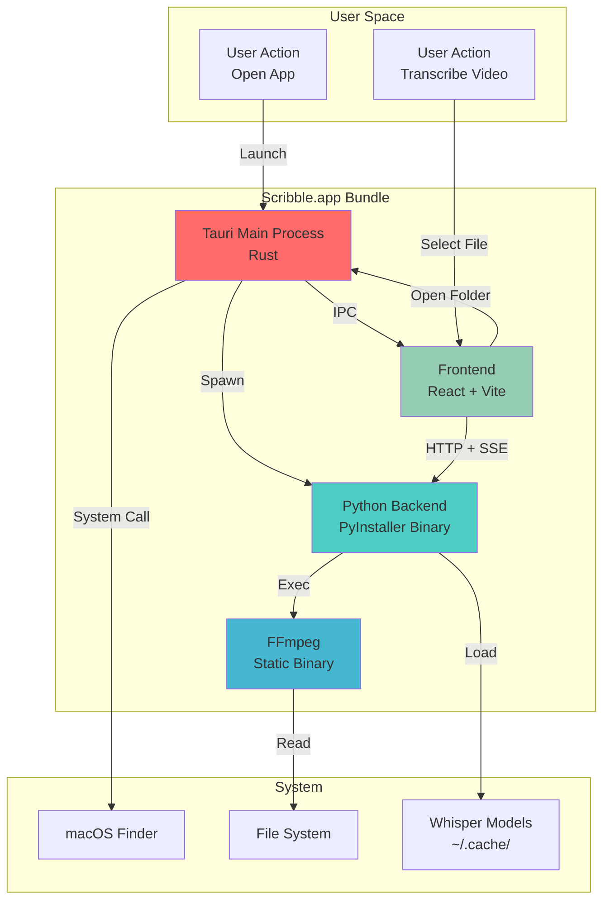

# Package "Scribble" as Distributable macOS Application

## Overview

Transform the Video Transcriber development application into "Scribble" - a double-clickable macOS application that users can download, install, and run without technical setup. The app will bundle the Python FastAPI backend as a Tauri sidecar, include FFmpeg for video processing, and be distributed as an unsigned DMG for testing and sharing.

**Goal**: Create a standalone `.app` bundle that:
- Auto-starts the Python backend when opened
- Requires zero command-line interaction
- Works on both Apple Silicon and Intel Macs
- Can be distributed via direct download (DMG)

## Problem Statement

### Current State (Development-Only)

**User Experience Today**:
```bash
# Terminal 1: Start backend
cd backend && source .venv/bin/activate
python -m uvicorn src.main:app --host 127.0.0.1 --port 8765

# Terminal 2: Start frontend
cd frontend && npm run tauri:dev
```

**Barriers to Distribution**:
- Python backend must be started manually
- Requires Python 3.11+, pip, virtual environments
- FFmpeg must be installed via Homebrew
- Users need Node.js and npm for development build
- No packaged installer (DMG/app bundle)
- Multiple terminal windows required

### Desired State (Production-Ready)

**User Experience Goal**:
1. Download `Scribble.dmg`
2. Drag `Scribble.app` to Applications folder
3. Double-click to launch (one-time security warning)
4. App opens, backend auto-starts, ready to transcribe

**No Prerequisites**:
- ✅ Python bundled as sidecar
- ✅ FFmpeg included in app bundle
- ✅ All dependencies packaged
- ✅ Single-click launch experience

## Proposed Solution

### Architecture

```
Scribble.app/
├── Contents/
    ├── Info.plist                        # macOS app metadata
    ├── MacOS/
    │   ├── Scribble                      # Main Tauri executable (Rust)
    │   ├── scribble-backend-aarch64-apple-darwin   # Python backend (Apple Silicon)
    │   ├── scribble-backend-x86_64-apple-darwin    # Python backend (Intel)
    │   ├── ffmpeg-aarch64-apple-darwin             # FFmpeg (Apple Silicon)
    │   └── ffmpeg-x86_64-apple-darwin              # FFmpeg (Intel)
    ├── Resources/
    │   ├── scribble.icns                 # App icon
    │   └── assets/                       # Frontend assets (HTML/CSS/JS)
    └── Frameworks/                       # Tauri dependencies
```

### Component Strategy

| Component | Strategy | Tool | Output Size |
|-----------|----------|------|-------------|
| **Python Backend** | Bundle as sidecar binary | PyInstaller | ~500MB-1GB |
| **FFmpeg** | Bundle static binary | evermeet.cx | ~100-150MB per arch |
| **Frontend** | Vite production build | Tauri CLI | ~5-10MB |
| **Icons** | Generate `.icns` from PNG | `tauri icon` | <1MB |
| **Total Bundle** | | | ~700MB-1.5GB |

### Tauri Sidecar Pattern

**Lifecycle Management**:
1. User launches `Scribble.app`
2. Tauri starts → Rust backend spawns Python sidecar
3. Python backend listens on `localhost:8765`
4. Frontend connects via HTTP/SSE
5. User quits app → Rust kills Python process (no orphans)

**Communication Flow**:
```
User Action → Tauri Window → HTTP Request → Python FastAPI → Whisper Model → SSE Progress → Frontend UI
                ↑                                   ↓
                └────── IPC (spawn/kill) ──────────┘
```

## Technical Approach

### Phase 1: Python Backend Bundling (Foundation)

**Goal**: Create standalone Python executables for both architectures.

#### 1.1. Install PyInstaller in Backend Environment ✅

**File**: `backend/requirements.txt`
```txt
# Add PyInstaller to existing dependencies
pyinstaller>=6.0.0
```

**Install**:
```bash
cd backend
source .venv/bin/activate
pip install pyinstaller
```

#### 1.2. Create PyInstaller Spec File ✅

**File**: `backend/backend.spec`
```python
# -*- mode: python ; coding: utf-8 -*-
from PyInstaller.utils.hooks import collect_data_files, collect_submodules

block_cipher = None

# Hidden imports for FastAPI ecosystem
hidden_imports = [
    'uvicorn.logging',
    'uvicorn.loops',
    'uvicorn.loops.auto',
    'uvicorn.protocols',
    'uvicorn.protocols.http',
    'uvicorn.protocols.http.auto',
    'uvicorn.protocols.websockets',
    'uvicorn.protocols.websockets.auto',
    'uvicorn.lifespan',
    'uvicorn.lifespan.on',
    'fastapi',
    'pydantic',
    'pydantic_core',
    'starlette',
]

# Add faster-whisper and torch
hidden_imports += collect_submodules('faster_whisper')
hidden_imports += collect_submodules('torch')

# Collect data files
datas = []
datas += collect_data_files('faster_whisper')
datas += collect_data_files('torch')

a = Analysis(
    ['src/main.py'],
    pathex=[],
    binaries=[],
    datas=datas,
    hiddenimports=hidden_imports,
    hookspath=[],
    hooksconfig={},
    runtime_hooks=[],
    excludes=[
        'matplotlib',
        'PIL',
        'tkinter',
        'IPython',
        'notebook',
        'jupyter',
    ],
    win_no_prefer_redirects=False,
    win_private_assemblies=False,
    cipher=block_cipher,
    noarchive=False,
)

pyz = PYZ(a.pure, a.zipped_data, cipher=block_cipher)

exe = EXE(
    pyz,
    a.scripts,
    [],
    exclude_binaries=True,
    name='scribble-backend',
    debug=False,
    bootloader_ignore_signals=False,
    strip=False,
    upx=True,
    console=True,
    disable_windowed_traceback=False,
    argv_emulation=False,
    target_arch='arm64',  # Will be overridden by --target-arch flag
    codesign_identity=None,
    entitlements_file=None,
)

coll = COLLECT(
    exe,
    a.binaries,
    a.zipfiles,
    a.datas,
    strip=False,
    upx=True,
    upx_exclude=[],
    name='scribble-backend',
)
```

**Key Configuration**:
- `console=True`: Backend runs as console app (no GUI)
- `target_arch='arm64'`: Default to Apple Silicon (override with `--target-arch=x86_64` for Intel)
- `exclude_binaries=True`: Separate binaries for smaller distribution
- `upx=True`: Compress executable with UPX

#### 1.3. Modify Backend to Accept Port Argument ✅

**File**: `backend/src/main.py`
```python
import os
import argparse
from fastapi import FastAPI

# Add argument parsing for sidecar execution
parser = argparse.ArgumentParser()
parser.add_argument('--port', type=int, default=8765)
args = parser.parse_args()

# Read auth token from environment variable (set by Tauri)
AUTH_TOKEN = os.getenv("AUTH_TOKEN")
if not AUTH_TOKEN:
    # Generate token if not provided (development mode)
    import uuid
    AUTH_TOKEN = str(uuid.uuid4())
    print(f"Generated auth token: {AUTH_TOKEN}")

# ... existing FastAPI setup ...

if __name__ == "__main__":
    import uvicorn
    uvicorn.run(app, host="127.0.0.1", port=args.port)
```

**Why**: Allows Tauri to specify port dynamically and pass auth token securely.

#### 1.4. Create Build Script for Multi-Architecture

**File**: `scripts/build-backend.sh`
```bash
#!/bin/bash
set -e

echo "Building Python backend for macOS..."

cd backend

# Ensure virtual environment exists
if [ ! -d ".venv" ]; then
    echo "Creating virtual environment..."
    python3 -m venv .venv
fi

# Activate virtual environment
source .venv/bin/activate

# Install dependencies including PyInstaller
echo "Installing dependencies..."
pip install -r requirements.txt

# Create output directory
mkdir -p ../frontend/src-tauri/binaries

# Build for Apple Silicon (arm64)
echo "Building for Apple Silicon (arm64)..."
pyinstaller --clean backend.spec --target-arch=arm64
cp dist/scribble-backend/scribble-backend ../frontend/src-tauri/binaries/scribble-backend-aarch64-apple-darwin
chmod +x ../frontend/src-tauri/binaries/scribble-backend-aarch64-apple-darwin

# Build for Intel (x86_64)
echo "Building for Intel (x86_64)..."
pyinstaller --clean backend.spec --target-arch=x86_64
cp dist/scribble-backend/scribble-backend ../frontend/src-tauri/binaries/scribble-backend-x86_64-apple-darwin
chmod +x ../frontend/src-tauri/binaries/scribble-backend-x86_64-apple-darwin

deactivate

echo "Backend binaries built successfully:"
ls -lh ../frontend/src-tauri/binaries/scribble-backend-*
```

**Make executable**:
```bash
chmod +x scripts/build-backend.sh
```

#### 1.5. Test Backend Binaries

**Verify they run standalone**:
```bash
# Test Apple Silicon binary (if on Apple Silicon Mac)
./frontend/src-tauri/binaries/scribble-backend-aarch64-apple-darwin --port 8765

# Test Intel binary (if on Intel Mac)
./frontend/src-tauri/binaries/scribble-backend-x86_64-apple-darwin --port 8765
```

**Expected output**:
```
Generated auth token: abc-123-xyz
INFO:     Started server process [12345]
INFO:     Waiting for application startup.
INFO:     Application startup complete.
INFO:     Uvicorn running on http://127.0.0.1:8765
```

---

### Phase 2: FFmpeg Integration

**Goal**: Bundle static FFmpeg binaries with the app.

#### 2.1. Download Static FFmpeg Binaries

**File**: `scripts/download-ffmpeg.sh`
```bash
#!/bin/bash
set -e

echo "Downloading FFmpeg static binaries for macOS..."

BINARIES_DIR="frontend/src-tauri/binaries"
mkdir -p "$BINARIES_DIR"

# Download for Apple Silicon (arm64)
if [ ! -f "$BINARIES_DIR/ffmpeg-aarch64-apple-darwin" ]; then
    echo "Downloading FFmpeg for Apple Silicon..."
    curl -L https://evermeet.cx/ffmpeg/getrelease/arm64/ffmpeg/zip -o ffmpeg-arm64.zip
    unzip -o ffmpeg-arm64.zip
    mv ffmpeg "$BINARIES_DIR/ffmpeg-aarch64-apple-darwin"
    chmod +x "$BINARIES_DIR/ffmpeg-aarch64-apple-darwin"
    rm ffmpeg-arm64.zip
    echo "✓ Apple Silicon FFmpeg downloaded"
else
    echo "✓ Apple Silicon FFmpeg already exists"
fi

# Download for Intel (x86_64)
if [ ! -f "$BINARIES_DIR/ffmpeg-x86_64-apple-darwin" ]; then
    echo "Downloading FFmpeg for Intel..."
    curl -L https://evermeet.cx/ffmpeg/getrelease/ffmpeg/zip -o ffmpeg-x64.zip
    unzip -o ffmpeg-x64.zip
    mv ffmpeg "$BINARIES_DIR/ffmpeg-x86_64-apple-darwin"
    chmod +x "$BINARIES_DIR/ffmpeg-x86_64-apple-darwin"
    rm ffmpeg-x64.zip
    echo "✓ Intel FFmpeg downloaded"
else
    echo "✓ Intel FFmpeg already exists"
fi

echo "FFmpeg binaries ready:"
ls -lh "$BINARIES_DIR/ffmpeg-*"
```

**Make executable**:
```bash
chmod +x scripts/download-ffmpeg.sh
```

#### 2.2. Update Backend to Use Bundled FFmpeg

**File**: `backend/src/services/audio_processor.py`

Add logic to detect bundled FFmpeg:

```python
import os
import shutil
from pathlib import Path

def get_ffmpeg_path() -> str:
    """
    Get FFmpeg path, preferring bundled version in production.
    Falls back to system FFmpeg in development.
    """
    # Check if running as PyInstaller bundle
    if getattr(sys, 'frozen', False):
        # Running as bundled executable
        bundle_dir = Path(sys._MEIPASS).parent

        # FFmpeg is placed in same directory as executable (MacOS/)
        ffmpeg_bundled = bundle_dir / "ffmpeg"
        if ffmpeg_bundled.exists():
            return str(ffmpeg_bundled)

    # Development: Use system FFmpeg
    ffmpeg_system = shutil.which("ffmpeg")
    if ffmpeg_system:
        return ffmpeg_system

    raise RuntimeError(
        "FFmpeg not found. Please install FFmpeg or use bundled version."
    )

# Update existing code to use get_ffmpeg_path()
FFMPEG_PATH = get_ffmpeg_path()
```

**Why**: Automatically detects if running as bundled app and uses the correct FFmpeg binary.

---

### Phase 3: Icon Generation

**Goal**: Create proper `.icns` icon file for macOS.

#### 3.1. Use Tauri Icon Generator (Recommended)

**Requirement**: A source PNG file at 1024x1024 with transparency.

**Option A: Use existing 512x512 icon**:
```bash
cd frontend
npm run tauri icon ../path/to/source-icon.png
```

**Option B: Manual generation if you have custom design**:

Create `scripts/generate-icons.sh`:
```bash
#!/bin/bash
set -e

SOURCE_PNG="$1"
OUTPUT_DIR="frontend/src-tauri/icons"

if [ -z "$SOURCE_PNG" ]; then
    echo "Usage: ./scripts/generate-icons.sh /path/to/icon-1024.png"
    exit 1
fi

if [ ! -f "$SOURCE_PNG" ]; then
    echo "Error: Source file not found: $SOURCE_PNG"
    exit 1
fi

echo "Generating icons from $SOURCE_PNG..."

mkdir -p "$OUTPUT_DIR"
ICONSET_DIR=$(mktemp -d)/scribble.iconset
mkdir -p "$ICONSET_DIR"

# Generate all required sizes
sips -z 16 16     "$SOURCE_PNG" --out "$ICONSET_DIR/icon_16x16.png"
sips -z 32 32     "$SOURCE_PNG" --out "$ICONSET_DIR/icon_16x16@2x.png"
sips -z 32 32     "$SOURCE_PNG" --out "$ICONSET_DIR/icon_32x32.png"
sips -z 64 64     "$SOURCE_PNG" --out "$ICONSET_DIR/icon_32x32@2x.png"
sips -z 128 128   "$SOURCE_PNG" --out "$ICONSET_DIR/icon_128x128.png"
sips -z 256 256   "$SOURCE_PNG" --out "$ICONSET_DIR/icon_128x128@2x.png"
sips -z 256 256   "$SOURCE_PNG" --out "$ICONSET_DIR/icon_256x256.png"
sips -z 512 512   "$SOURCE_PNG" --out "$ICONSET_DIR/icon_256x256@2x.png"
sips -z 512 512   "$SOURCE_PNG" --out "$ICONSET_DIR/icon_512x512.png"
sips -z 1024 1024 "$SOURCE_PNG" --out "$ICONSET_DIR/icon_512x512@2x.png"

# Convert to .icns
iconutil -c icns "$ICONSET_DIR" -o "$OUTPUT_DIR/icon.icns"

echo "✓ Generated icon.icns"
ls -lh "$OUTPUT_DIR/icon.icns"
```

**Make executable**:
```bash
chmod +x scripts/generate-icons.sh
```

---

### Phase 4: Tauri Sidecar Configuration

**Goal**: Configure Tauri to spawn Python backend and FFmpeg as sidecars.

#### 4.1. Update tauri.conf.json

**File**: `frontend/src-tauri/tauri.conf.json`

```json
{
  "productName": "Scribble",
  "version": "1.0.0",
  "identifier": "com.scribble.app",
  "build": {
    "beforeDevCommand": "npm run dev",
    "beforeBuildCommand": "npm run build",
    "devUrl": "http://localhost:1420",
    "frontendDist": "../dist"
  },
  "bundle": {
    "active": true,
    "targets": ["dmg"],
    "icon": [
      "icons/icon.icns"
    ],
    "externalBin": [
      "binaries/scribble-backend",
      "binaries/ffmpeg"
    ],
    "macOS": {
      "minimumSystemVersion": "11.0",
      "hardenedRuntime": true,
      "dmg": {
        "appPosition": {
          "x": 180,
          "y": 170
        },
        "applicationFolderPosition": {
          "x": 480,
          "y": 170
        },
        "windowSize": {
          "height": 400,
          "width": 660
        }
      }
    }
  },
  "app": {
    "windows": [
      {
        "label": "main",
        "title": "Scribble",
        "width": 1200,
        "height": 800,
        "resizable": true,
        "fullscreen": false
      }
    ],
    "security": {
      "csp": null,
      "capabilities": ["default"]
    }
  }
}
```

**Key Changes**:
- `productName`: "Scribble" (new branding)
- `identifier`: "com.scribble.app" (unique bundle ID)
- `externalBin`: Declares sidecars (Tauri auto-appends target triple)
- `targets`: ["dmg"] (macOS DMG only)
- `icon`: ["icons/icon.icns"] (macOS icon file)
- `minimumSystemVersion`: "11.0" (macOS Big Sur+)

#### 4.2. Update Capabilities for Sidecar Execution

**File**: `frontend/src-tauri/capabilities/default.json`

```json
{
  "$schema": "../gen/schemas/desktop-schema.json",
  "identifier": "default",
  "description": "Default permissions for Scribble",
  "windows": ["main"],
  "permissions": [
    "dialog:default",
    "core:default",
    {
      "identifier": "shell:allow-execute",
      "allow": [
        {
          "name": "binaries/scribble-backend",
          "sidecar": true,
          "args": true
        },
        {
          "name": "binaries/ffmpeg",
          "sidecar": true,
          "args": true
        }
      ]
    }
  ]
}
```

**Permissions Added**:
- `shell:allow-execute`: Required to spawn sidecar processes
- `sidecar: true`: Marks binaries as trusted sidecars
- `args: true`: Allows passing arguments (e.g., `--port 8765`)

#### 4.3. Implement Sidecar Lifecycle in Rust

**File**: `frontend/src-tauri/src/main.rs`

Replace existing code with:

```rust
use tauri::{Manager, Emitter, AppHandle, State};
use tauri_plugin_shell::ShellExt;
use tauri_plugin_shell::process::CommandEvent;
use std::sync::Mutex;
use uuid::Uuid;

// State to track backend process
struct BackendState {
    child: Mutex<Option<tauri_plugin_shell::process::Child>>,
    auth_token: Mutex<Option<String>>,
}

#[tauri::command]
async fn start_backend(
    app: AppHandle,
    state: State<'_, BackendState>,
) -> Result<String, String> {
    // Check if already running
    if state.child.lock().unwrap().is_some() {
        return Err("Backend already running".to_string());
    }

    // Generate secure auth token
    let auth_token = Uuid::new_v4().to_string();
    *state.auth_token.lock().unwrap() = Some(auth_token.clone());

    // Spawn backend sidecar
    let sidecar_command = app
        .shell()
        .sidecar("scribble-backend")
        .map_err(|e| format!("Failed to find backend binary: {}", e))?
        .args(&["--port", "8765"])
        .env("AUTH_TOKEN", &auth_token);

    let (mut rx, child) = sidecar_command
        .spawn()
        .map_err(|e| format!("Failed to spawn backend: {}", e))?;

    let pid = child.pid();
    *state.child.lock().unwrap() = Some(child);

    // Monitor backend output
    let app_handle = app.clone();
    tauri::async_runtime::spawn(async move {
        while let Some(event) = rx.recv().await {
            match event {
                CommandEvent::Stdout(line_bytes) => {
                    let line = String::from_utf8_lossy(&line_bytes);
                    app_handle.emit("backend-log", line.to_string()).ok();
                }
                CommandEvent::Stderr(line_bytes) => {
                    let line = String::from_utf8_lossy(&line_bytes);
                    app_handle.emit("backend-error", line.to_string()).ok();
                }
                CommandEvent::Terminated(payload) => {
                    app_handle
                        .emit("backend-stopped", format!("Exit code: {:?}", payload.code))
                        .ok();
                    break;
                }
                _ => {}
            }
        }
    });

    Ok(format!("Backend started with PID: {}, Token: {}", pid, auth_token))
}

#[tauri::command]
async fn stop_backend(state: State<'_, BackendState>) -> Result<(), String> {
    if let Some(child) = state.child.lock().unwrap().take() {
        child.kill().map_err(|e| format!("Failed to kill backend: {}", e))?;
    }
    *state.auth_token.lock().unwrap() = None;
    Ok(())
}

#[tauri::command]
fn get_auth_token(state: State<'_, BackendState>) -> Result<String, String> {
    state
        .auth_token
        .lock()
        .unwrap()
        .clone()
        .ok_or_else(|| "Backend not started".to_string())
}

// Import existing open_folder command
mod commands;

#[cfg_attr(mobile, tauri::mobile_entry_point)]
pub fn run() {
    tauri::Builder::default()
        .plugin(tauri_plugin_shell::init())
        .plugin(tauri_plugin_dialog::init())
        .manage(BackendState {
            child: Mutex::new(None),
            auth_token: Mutex::new(None),
        })
        .invoke_handler(tauri::generate_handler![
            commands::open_folder,
            start_backend,
            stop_backend,
            get_auth_token
        ])
        .setup(|app| {
            // Auto-start backend on app launch
            let app_handle = app.handle().clone();
            tauri::async_runtime::spawn(async move {
                // Wait for window to be ready
                tokio::time::sleep(tokio::time::Duration::from_millis(500)).await;

                let state: State<BackendState> = app_handle.state();
                match start_backend(app_handle.clone(), state).await {
                    Ok(msg) => println!("Backend auto-started: {}", msg),
                    Err(e) => eprintln!("Failed to auto-start backend: {}", e),
                }
            });
            Ok(())
        })
        .build(tauri::generate_context!())
        .expect("error while building tauri application")
        .run(|app_handle, event| {
            if let tauri::RunEvent::Exit = event {
                // Cleanup on app exit
                let state: State<BackendState> = app_handle.state();
                if let Some(child) = state.child.lock().unwrap().take() {
                    let _ = child.kill();
                    println!("Backend process cleaned up on exit");
                }
            }
        });
}
```

**Key Features**:
- `start_backend()`: Spawns Python backend with auth token
- `stop_backend()`: Gracefully kills backend process
- `get_auth_token()`: Returns token for frontend to use in HTTP headers
- Auto-start in `setup()` hook (backend starts when app opens)
- Auto-cleanup in `run()` event handler (kills backend when app quits)

#### 4.4. Add Rust Dependencies

**File**: `frontend/src-tauri/Cargo.toml`

Add to `[dependencies]`:
```toml
uuid = { version = "1.0", features = ["v4"] }
tokio = { version = "1", features = ["time"] }
```

---

### Phase 5: Frontend Integration

**Goal**: Update frontend to communicate with bundled backend.

#### 5.1. Update API Client to Use Auth Token

**File**: `frontend/src/api/transcription.ts`

```typescript
import { invoke } from '@tauri-apps/api/core';

let authToken: string | null = null;

// Get auth token from backend on app start
export async function initializeApi(): Promise<void> {
  try {
    authToken = await invoke<string>('get_auth_token');
    console.log('API initialized with auth token');
  } catch (error) {
    console.error('Failed to get auth token:', error);
    throw error;
  }
}

// Update existing fetch calls to include auth header
export async function transcribeVideo(videoPath: string): Promise<Response> {
  if (!authToken) {
    throw new Error('API not initialized. Call initializeApi() first.');
  }

  return fetch('http://localhost:8765/transcribe', {
    method: 'POST',
    headers: {
      'Content-Type': 'application/json',
      'Authorization': `Bearer ${authToken}`,
    },
    body: JSON.stringify({ video_path: videoPath }),
  });
}
```

#### 5.2. Initialize API on App Mount

**File**: `frontend/src/App.tsx`

```tsx
import { useEffect } from 'react';
import { initializeApi } from './api/transcription';

function App() {
  useEffect(() => {
    // Initialize API connection on mount
    initializeApi()
      .then(() => console.log('Backend connection established'))
      .catch((error) => console.error('Backend initialization failed:', error));
  }, []);

  // ... rest of component
}
```

---

### Phase 6: Build Automation

**Goal**: Create unified build script for complete app packaging.

#### 6.1. Master Build Script

**File**: `scripts/build-macos-app.sh`

```bash
#!/bin/bash
set -e

echo "========================================="
echo "Building Scribble for macOS"
echo "========================================="
echo ""

# Step 1: Build Python backend
echo "Step 1: Building Python backend..."
./scripts/build-backend.sh
echo "✓ Backend built"
echo ""

# Step 2: Download FFmpeg binaries
echo "Step 2: Downloading FFmpeg..."
./scripts/download-ffmpeg.sh
echo "✓ FFmpeg ready"
echo ""

# Step 3: Generate icons (if source exists)
if [ -f "assets/icon-source.png" ]; then
    echo "Step 3: Generating icons..."
    cd frontend
    npm run tauri icon ../assets/icon-source.png
    cd ..
    echo "✓ Icons generated"
else
    echo "Step 3: Skipping icon generation (no source file)"
fi
echo ""

# Step 4: Build Tauri app
echo "Step 4: Building Tauri application..."
cd frontend
npm install
npm run tauri build -- --bundles dmg
cd ..
echo "✓ Tauri app built"
echo ""

# Step 5: Show output location
echo "========================================="
echo "Build Complete!"
echo "========================================="
echo ""
echo "DMG Location:"
echo "  frontend/src-tauri/target/release/bundle/dmg/Scribble_1.0.0_aarch64.dmg"
echo "  frontend/src-tauri/target/release/bundle/dmg/Scribble_1.0.0_x64.dmg"
echo ""
echo "App Bundle:"
echo "  frontend/src-tauri/target/release/bundle/macos/Scribble.app"
echo ""
echo "Next steps:"
echo "  1. Test the DMG on a clean Mac"
echo "  2. Verify backend auto-starts and transcription works"
echo "  3. Check for orphan processes after quitting app"
echo ""
```

**Make executable**:
```bash
chmod +x scripts/build-macos-app.sh
```

#### 6.2. Quick Development Build

**File**: `package.json` (in root)

```json
{
  "name": "scribble",
  "version": "1.0.0",
  "scripts": {
    "build:backend": "./scripts/build-backend.sh",
    "build:ffmpeg": "./scripts/download-ffmpeg.sh",
    "build:icons": "./scripts/generate-icons.sh assets/icon-source.png",
    "build:all": "./scripts/build-macos-app.sh",
    "dev": "cd frontend && npm run tauri:dev"
  }
}
```

**Usage**:
```bash
npm run build:all   # Full production build
npm run dev         # Development mode (separate backend)
```

---

### Phase 7: Distribution Preparation

**Goal**: Prepare DMG with user instructions for unsigned distribution.

#### 7.1. Create Installation Guide

**File**: `INSTALLATION.md`

```markdown
# Installing Scribble on macOS

## Download and Install

1. **Download** `Scribble.dmg` from the releases page
2. **Open** the DMG file (double-click)
3. **Drag** Scribble.app to your Applications folder
4. **Eject** the Scribble disk image

## First Launch (Security Warning)

When you first launch Scribble, macOS will show a security warning because the app is not notarized by Apple.

### Option 1: Right-Click Method (Easiest)

1. Navigate to Applications folder
2. **Right-click** (or Control+click) on Scribble.app
3. Select **"Open"** from the context menu
4. Click **"Open"** in the security dialog
5. The app will launch normally on all future opens

### Option 2: System Settings Method

1. Try to open Scribble.app (you'll see a warning)
2. Open **System Settings** → **Privacy & Security**
3. Scroll down to the **Security** section
4. Click **"Open Anyway"** next to the Scribble message
5. Confirm by clicking **"Open"**

### Option 3: Terminal Method (Advanced)

```bash
xattr -cr /Applications/Scribble.app
```

Then open the app normally.

## System Requirements

- **macOS**: 11.0 (Big Sur) or later
- **Architecture**: Apple Silicon (M1/M2/M3) or Intel
- **Disk Space**: ~2GB for app + models
- **RAM**: 8GB minimum, 16GB recommended
- **Internet**: Required for downloading Whisper models on first use

## What Happens on First Run

1. Scribble will auto-start the transcription backend
2. The first transcription will download the Whisper model (~1-3GB)
3. Models are cached at `~/.cache/huggingface/hub/`
4. Subsequent transcriptions are faster (no download)

## Troubleshooting

### "Backend failed to start"

- Check if port 8765 is already in use: `lsof -i :8765`
- Quit and relaunch Scribble

### "FFmpeg not found"

- This should never happen with bundled version
- If it does, report as a bug

### App crashes on launch

- Check Console.app for crash logs
- Look for "Scribble" in system logs
- Report with logs to: [GitHub Issues](https://github.com/yourname/scribble/issues)

## Uninstalling

1. Quit Scribble
2. Drag Scribble.app to Trash
3. Delete cached models (optional): `rm -rf ~/.cache/huggingface/hub/`

## Privacy

Scribble runs **100% locally** on your Mac:
- No data is sent to external servers
- No internet connection required (after model download)
- Transcriptions are saved to your local disk only
```

#### 7.2. Create README for Distribution

**File**: `README-DIST.md` (included in DMG)

```markdown
# Scribble - Local Video Transcription

Transcribe videos to text using Whisper AI, running entirely on your Mac.

## Installation

1. Drag **Scribble.app** to your **Applications** folder
2. On first launch, right-click → Open (macOS security warning)
3. See **INSTALLATION.md** for detailed instructions

## Features

✨ **Local Processing** - No internet required (after setup)
🚀 **Fast** - Uses GPU acceleration (Apple Silicon, NVIDIA)
🎯 **Accurate** - Powered by OpenAI's Whisper model
📂 **Simple** - Drag & drop videos to transcribe

## Supported Formats

- MP4, MOV, AVI, MKV, WebM
- Any video format supported by FFmpeg

## System Requirements

- macOS 11.0+ (Big Sur or later)
- 8GB RAM minimum
- 2GB disk space for app + models

## Need Help?

See **INSTALLATION.md** for setup instructions and troubleshooting.
```

---

## Alternative Approaches Considered

### 1. PyOxidizer Instead of PyInstaller

**Pros**:
- Single-file executable
- Faster startup time
- Smaller binary size

**Cons**:
- Poor FastAPI/uvicorn compatibility
- Difficult to configure with torch/faster-whisper
- More complex debugging

**Decision**: **Rejected** - PyInstaller has better ecosystem support for our dependencies.

### 2. Embedded Python Runtime

**Pros**:
- Full Python environment available
- Easy debugging
- More flexible than frozen binaries

**Cons**:
- ~500MB larger bundle size
- Must package entire virtual environment
- Security risk (modifiable Python code)

**Decision**: **Rejected** - PyInstaller provides sufficient isolation with better security.

### 3. Separate Backend Installer

**Pros**:
- Smaller frontend bundle
- Backend could be updated independently
- Simpler build process

**Cons**:
- Terrible user experience (two-step installation)
- Users need to manage Python/pip
- Not "double-click to run"

**Decision**: **Rejected** - Violates goal of zero-setup installation.

### 4. Mac App Store Distribution

**Pros**:
- Built-in distribution mechanism
- Automatic updates
- No Gatekeeper warnings

**Cons**:
- Requires $99/year Apple Developer Program
- Strict sandboxing requirements
- Difficult to bundle Python/FFmpeg
- Review process delays

**Decision**: **Deferred** - Start with direct distribution, consider App Store later.

---

## Acceptance Criteria

### Functional Requirements

- [ ] **Double-click launch**: User can open Scribble.app and it works
- [ ] **Backend auto-start**: Python backend spawns automatically on app launch
- [ ] **Backend auto-stop**: Python process is killed when app quits (no orphans)
- [ ] **Transcription works**: User can transcribe videos end-to-end
- [ ] **Open folder works**: "Open Folder" button launches Finder to transcription output
- [ ] **Cross-architecture**: Works on both Apple Silicon and Intel Macs
- [ ] **Offline capable**: App works without internet (after initial model download)

### Non-Functional Requirements

- [ ] **Bundle size**: DMG ≤ 1.5GB
- [ ] **Launch time**: App opens in < 5 seconds
- [ ] **Backend startup**: Backend ready within 2 seconds of app launch
- [ ] **No terminal required**: Zero command-line interaction needed
- [ ] **Clean uninstall**: Dragging to Trash removes all app files (except cached models)

### Quality Gates

- [ ] **No orphan processes**: `ps aux | grep scribble-backend` shows 0 after quit
- [ ] **No port conflicts**: Backend binds to 8765 or fails gracefully
- [ ] **Icon displays**: Scribble icon shows in Finder, Dock, and Cmd+Tab
- [ ] **First-launch UX**: Security warning is handled with clear instructions
- [ ] **Error handling**: App shows user-friendly errors if backend fails to start

---

## Success Metrics

**Quantitative**:
- Bundle size: 700MB-1.5GB (target: <1GB)
- Launch time: <5 seconds (target: <3 seconds)
- Backend startup: <2 seconds (target: <1 second)
- Build time: <10 minutes (target: <5 minutes)

**Qualitative**:
- User can install without reading documentation
- Non-technical users can get past security warning
- No "it doesn't work" issues due to missing dependencies

---

## Dependencies & Prerequisites

### Development Environment

- macOS 11.0+ (for building)
- Python 3.11+ (for PyInstaller)
- Node.js 18+ (for frontend build)
- Rust/Cargo (installed by Tauri)
- Xcode Command Line Tools (`xcode-select --install`)

### Build Tools

- PyInstaller 6.0+
- Tauri CLI 2.0+
- iconutil (built into macOS)
- curl (for downloading FFmpeg)

### External Dependencies

- FFmpeg static binaries from evermeet.cx
- No Apple Developer account needed (unsigned distribution)

---

## Risk Analysis & Mitigation

### High-Risk Items

| Risk | Impact | Likelihood | Mitigation |
|------|--------|------------|------------|
| PyInstaller fails to bundle torch/faster-whisper | **Critical** | Medium | Test early, use hooks, check PyInstaller logs |
| Backend doesn't auto-start | **Critical** | Low | Comprehensive testing, fallback to manual start |
| Orphan backend processes | **High** | Medium | Test cleanup thoroughly, monitor process table |
| Bundle size > 2GB | **Medium** | Medium | Use UPX compression, exclude unnecessary modules |
| Icon doesn't display | **Low** | Low | Test on clean Mac, verify .icns format |

### Security Risks

| Risk | Mitigation |
|------|------------|
| Unsigned app triggers Gatekeeper | Provide clear installation instructions |
| Users bypass security checks | Include warnings about downloading only from official source |
| Backend exposed on localhost | Use auth token, bind to 127.0.0.1 only |

---

## Resource Requirements

### Development Time

| Phase | Estimated Time | Complexity |
|-------|----------------|------------|
| Phase 1: Python Bundling | 4-6 hours | Medium |
| Phase 2: FFmpeg Integration | 2-3 hours | Low |
| Phase 3: Icon Generation | 1-2 hours | Low |
| Phase 4: Tauri Sidecar | 4-6 hours | Medium-High |
| Phase 5: Frontend Integration | 2-3 hours | Low |
| Phase 6: Build Automation | 2-3 hours | Medium |
| Phase 7: Distribution Prep | 1-2 hours | Low |
| **Testing & Debugging** | 4-8 hours | Medium |
| **Total** | **20-33 hours** | |

### Team Requirements

- **Developer**: 1 person (full-stack: Rust + Python + TypeScript)
- **Tester**: 1 person (manual testing on clean Mac)
- **Designer** (optional): Create custom app icon

### Infrastructure

- **Development Mac**: Apple Silicon or Intel
- **Test Mac**: Clean macOS 11.0+ system (for testing DMG installation)
- **Storage**: ~5GB for build artifacts and caches

---

## Future Considerations

### Post-MVP Enhancements

1. **Code Signing & Notarization**
   - Get Apple Developer ID
   - Sign app bundle
   - Notarize with Apple
   - Eliminate Gatekeeper warnings

2. **Auto-Updates**
   - Integrate Tauri Updater plugin
   - Host releases on GitHub Releases
   - In-app update notifications

3. **Crash Reporting**
   - Integrate Sentry or similar
   - Automatic crash log submission
   - Anonymous usage analytics

4. **Advanced DMG Customization**
   - Custom background image
   - Prettier install layout
   - EULA/license agreement

5. **Windows & Linux Support**
   - Build MSI/EXE for Windows
   - Build AppImage/deb for Linux
   - Cross-platform build pipeline

### Extensibility

- Plugin system for custom Whisper models
- User-selectable backend ports
- Configurable FFmpeg parameters
- Theme customization

---

## Documentation Requirements

### User Documentation

- [ ] `INSTALLATION.md` - Setup instructions with screenshots
- [ ] `README-DIST.md` - Quick start guide for DMG
- [ ] FAQ document - Common issues and solutions

### Developer Documentation

- [ ] `BUILDING.md` - Build instructions for developers
- [ ] `ARCHITECTURE.md` - Sidecar communication patterns
- [ ] Code comments in `main.rs` for lifecycle management

### Release Documentation

- [ ] Release notes template
- [ ] Changelog format
- [ ] Version numbering scheme (semantic versioning)

---

## Testing Checklist

### Unit Tests

- [ ] Backend CLI args parsing (`--port` flag)
- [ ] Auth token validation in FastAPI
- [ ] FFmpeg path detection logic

### Integration Tests

- [ ] Sidecar spawning and cleanup
- [ ] Frontend ↔ Backend communication
- [ ] Auth token flow end-to-end

### Manual Testing

- [ ] **Fresh Install Test** (on clean Mac)
  - [ ] Download DMG
  - [ ] Drag to Applications
  - [ ] Right-click → Open (security warning)
  - [ ] App launches successfully
  - [ ] Backend auto-starts (check logs)
  - [ ] Transcribe a video end-to-end
  - [ ] Open folder button works
  - [ ] Quit app
  - [ ] Verify no orphan processes (`ps aux | grep scribble`)

- [ ] **Architecture Test**
  - [ ] Test on Apple Silicon Mac
  - [ ] Test on Intel Mac
  - [ ] Verify correct binary is used (check Activity Monitor)

- [ ] **Lifecycle Test**
  - [ ] Force quit app (Cmd+Q)
  - [ ] Kill via Activity Monitor
  - [ ] Verify backend is killed in all scenarios
  - [ ] No stale PID files or sockets

- [ ] **Error Scenarios**
  - [ ] Port 8765 already in use
  - [ ] Backend binary is missing
  - [ ] FFmpeg binary is missing
  - [ ] No internet (after models cached)

- [ ] **Performance Test**
  - [ ] Measure app launch time
  - [ ] Measure backend startup time
  - [ ] Transcribe 10-minute video
  - [ ] Monitor memory usage

---

## References & Research

### Internal References

**Project Files**:
- Current Tauri config: `frontend/src-tauri/tauri.conf.json:1`
- Backend entry point: `backend/src/main.py:1`
- Existing scripts: `scripts/start-app.sh:1`
- Icons directory: `frontend/src-tauri/icons/`

**Documentation**:
- Backend MVP: `PHASE1_SUMMARY.md`
- Desktop UI: `PHASE2_SUMMARY.md`
- Open folder security: `docs/solutions/code-quality/eliminate-duplication-tauri-commands.md`

### External References

**Tauri Official Documentation**:
- [Embedding External Binaries | Tauri](https://v2.tauri.app/develop/sidecar/)
- [DMG | Tauri](https://v2.tauri.app/distribute/dmg/)
- [macOS Application Bundle | Tauri](https://v2.tauri.app/distribute/macos-application-bundle/)
- [Icon Configuration | Tauri](https://v2.tauri.app/develop/icons/)

**Community Examples**:
- [GitHub - dieharders/example-tauri-v2-python-server-sidecar](https://github.com/dieharders/example-tauri-v2-python-server-sidecar)
- [GitHub - AlanSynn/vue-tauri-fastapi-sidecar-template](https://github.com/AlanSynn/vue-tauri-fastapi-sidecar-template)

**Python Packaging**:
- [PyInstaller Documentation Release 6.18.0](https://app.readthedocs.org/projects/pyinstaller/downloads/pdf/stable/)

**FFmpeg**:
- [static FFmpeg binaries for macOS 64-bit](https://evermeet.cx/ffmpeg/)

**macOS Security**:
- [Gatekeeper Explained: macOS App Security](https://anavem.com/glossary/gatekeeper)

---

## Related Issues

- Issue #001: Command Injection - Path validation (resolved, security model applies here)
- Issue #003: Unsupported Platform Handling (pattern reused for sidecar detection)

---

## Implementation Phases Summary

```
Phase 1: Python Backend Bundling (6h)
  └─ PyInstaller spec file, build script, multi-arch binaries

Phase 2: FFmpeg Integration (3h)
  └─ Download script, bundle config, backend path detection

Phase 3: Icon Generation (2h)
  └─ ICNS creation, Tauri icon tool

Phase 4: Tauri Sidecar (6h)
  └─ Config, Rust lifecycle, permissions, auto-start/stop

Phase 5: Frontend Integration (3h)
  └─ Auth token flow, API initialization

Phase 6: Build Automation (3h)
  └─ Master build script, package.json scripts

Phase 7: Distribution (2h)
  └─ Installation guide, README, testing checklist

Total: ~25 hours of development + 5-10 hours testing
```

---

## ERD: App Architecture



---

**Plan Version**: 1.0
**Last Updated**: 2026-02-13
**Status**: Ready for Implementation
